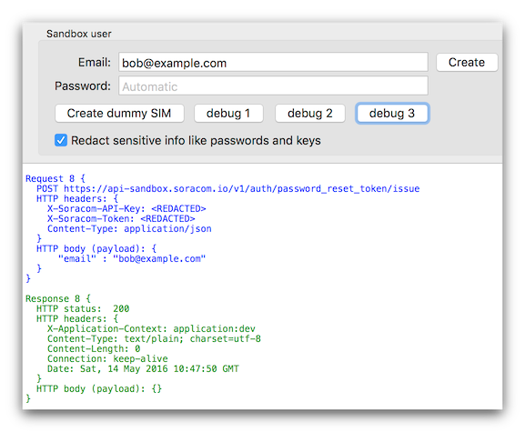

# soracom-sdk-swift

An SDK for the Soracom API in Swift.

Current status (2016-08-04): This SDK is a work in progress, and is still in the design stage. It currently only implements a portion of the API, as an example; complete API support is coming Real Soon Now&trade;. 

## Contents

- [Target audience](#target-audience)
- [Demo apps](#demo-apps)
- [The basics](#the-basics)
- [Creating a request](#creating-a-request)
- [Processing a response](#processing-a-response)
- [Using operation queues](#using-operation-queues)
- [Synchronous requests](#synchronous-requests)
- [Code examples](#code-examples)
- [Running the automated tests](#running-the-automated-tests)
- [For more information](#for-more-information)
- [License](#license)

## Target audience
This SDK is intended for programmers who want to interact with the [Soracom API](https://dev.soracom.io/jp/docs/api_guide/) from Swift code.

The (revised) goal is to support iOS 10 and macOS 10.12, initially.  Using this SDK for development requires a [Soracom account](https://console.soracom.io/#/signup) and [Xcode 8](https://developer.apple.com/xcode/).

A future goal, after Swift 3 has been released, is to to build as [a Swift 3 package](https://swift.org/package-manager/#conceptual-overview), and to fully support Linux (and, hopefully, [other significant platforms?](http://thenextweb.com/dd/2016/04/07/google-facebook-uber-swift/)).


## Demo apps
The Mac demo app lets you interactively play with some of the API features, and is probably the easiest way to get started. It prints out a color-coded text representation every request and response, to illustrate how the API works:


The demo app creates a user in the API Sandbox, which can then be used for testing and experimentation. The app includes various examples of how to use the API, and provides a ready-made environment where new code can be easily added and debugged.

It also serves as the test host for all of the SDK's automated tests.

There is also an iOS demo app. Unlike the Mac app, it doesn't really have any functionality beyond logging into the API Sandbox and running the automated test suite.


## The basics
The SDK is designed around two objects: `Request` and `Response`.

A `Request` instance encapsulates all the details of (and executes) an HTTP request, while the corresponding `Response` object contains the result after execution.

The SDK is fundamentally asynchronous, doing its network communications in the background. However, there are built-in conveniences for using an operation queue to perform requests sequentially, and also for making API requests synchronously, if needed.


## Creating a request

Request objects are normally created by using one of the convenience constructor class methods.

```swift

// 1. Create a Request instance. This creates, but does not
// yet execute, a request to issue a password reset token:

let req = Request.issuePasswordResetToken("bob@example.com")

// 2. Set the responseHandler (a closure that will execute asynchronously):

req.responseHandler = { (response) in

    if let error = response.error {
        print("😞 Failed to issue token: \(error)" )
    } else {
        print("😁 Token issued successfully!" )
        // the token has been sent via email
    }
}

// 3. Run the request. This sends the HTTP request to the API server,
// and awaits the response. Once the response is obtained from the
// server, the responseHandler set above will execute.

req.run()
```


## Processing a response

The type of the `responseHandler` instance property is `ResponseHandler`, which is defined like this:

```swift
public typealias ResponseHandler = ((Response) -> ())
```

So, it is a simple closure with a single parameter: a `Response` instance.

Instances of this type contain data returned by the server. If the server returns a data payload, the response will contain that payload. If an error occurs, the response will contain the error.

When a request is executed, the HTTP network communications are performed in a background thread. Upon completion (or error), a response object is initialized and populated with data. Finally, the request's response handler is executed, with the response object passed as the single argument.


#### Handling errors
If we actually run that code above, we will see this in the Xcode debugger:

```
😞 Failed to issue token: APIError(code: "AUM0004", message: "Invalid email address.", underlyingError: nil)
```

That's the expected behavior; since there isn't actually a `bob@example.com` user, a password reset token cannot be issued, and the API server reports that to us as an error.

The Swift SDK will automatically construct an `APIError` if an error occurs. As illustrated in the example above, within the response handler, the `request.error` property will hold the error. It will be set to `nil` if no error occurred.

#### Handling returned data

Not all API requests return data; many simply return a status code which indicates success or failure. For example, the `issuePasswordResetToken()` request above does its work and the API server just responds with an `HTTP 200` status to indicate success.

We can see this in action by using the SDK demo app to create the `bob@example.com` user (in the API Sandbox), and then use it to re-run the request above:



Textual representations of both the request sent and the response received are shown.

The `Request.issuePasswordResetToken() ` convenience constructor handles the details of creating the setting the API request URI, the HTTP verb to use, what HTTP headers need to be included, and how to encode the data payload (if any) that is sent in the body of the request.

Looking at the response (shown in green), we can see that the value of `response.HTTPStatus` is 200, and that it returned an empty payload (HTTP message body).

In simple cases like this, you don't typically need to do anything with the respond beyond checking to see if an error occurred. But other times, you may need to retrieve data from the payload of the response.

For example, the `auth()` API method requires data be submitted with the request, and upon success it sends back data with the response.

Example:

```swift

let credentials = getCredentials()

// 1. Create the request object:

let authReq = Request.auth(credentials)

// 2. Execute the request. Instead of first setting the
// responseHandler property, you can supply the run handler as
// a parameter to run(), using Swift trailing closure syntax:

authReq.run { (response) in

    if let payload = response.payload, token = payload[.token] {
        print("Authenticated successfully. 😁")
        print("Token: \(token)")

    } else {
        print("Authentication failed: \(response.error)")
    }
}

```

Here, instead of explicitly checking for an error, we instead just check for the values we require in the returned data.

If the response has a payload, and the payload contains a value for `.token`, then we have what we need. Running the above code in the demo app results in something like this:

```
🚀 Will try to authenticate as the API Sandbox user...

Request 31 {
  POST https://api-sandbox.soracom.io/v1/auth
  HTTP headers: {
    Content-Type: application/json
  }
  HTTP body (payload): {
      "email" : "alice@example.com",
      "tokenTimeoutSeconds" : 86400,
      "password" : "<REDACTED>"
  }
}

Response 31 {
  HTTP status:  200
  HTTP headers: {
    X-Application-Context: application:dev
    Content-Type: application/json;charset=UTF-8
    Content-Length: 1695
    Connection: keep-alive
    Date: Sat, 14 May 2016 11:25:04 GMT
  }
  HTTP body (payload): {
      "operatorId" : "OP0094879294",
      "token" : "<REDACTED>",
      "apiKey" : "a08a079b-fbdc-4276-aa61-7b9184bd061a",
      "userName" : null
  }
}

Authenticated successfully. 😁
```


#### The Payload class

This introduces the `Payload` object. Both `Request` and `Response` use the `Payload` class to represent the data payload that is sent in the HTTP message body.

The `Payload` class is in many ways similar to a Swift dictionary (although it can also represent an array). It conforms to the `ExpressibleByDictionaryLiteral` protocol, so it can be initialized like a Swift dictionary:

```swift
let p: Payload = [
    .cvc         : "123",
    .expireMonth : 12,
    .expireYear  : 20,
    .name        : "SORAO TAMAGAWA",
    .number      : "4242424242424242",
]

let name  = p[.name]  // → "SORAO TAMAGAWA"
let token = p[.token] // → nil
let bogus = p[.bogus] // this line results in compile-time error
```

When your code creates a request object, the Request class typically builds a payload object automatically. So it is probably more common that your code will want to read data from the payload of a response object. In general, this works just like a dictionary:

```swift
let ipAddress = payload[.ipAddress],
let type      = payload[.type]
```

Payload works like a Swift dictionary of type `[PayloadKey: AnyObject]` . The keys must be values defined by the `PayloadKey` enum. This allows Xcode to flag most mistyped keys as a compile-time error:


A common idiom in response handlers is to use `if let` to simultaneously check for the existence of a payload in the response, and for a set of required values that should be in the payload:

```swift
if  let payload   = response.payload,
    let ipAddress = payload[.ipAddress],
    let type      = payload[.type]
{
    // do something with ipAddress and type
} else {
    // handle failure
}
```

## Using operation queues

As illustrated a above, the basic procedure for using this SDK to make requests to the API server is:

1. create a request object
2. run the request
3. wait for the response handler to be called to process the result

That's fine for simple one-off operations like *authenticate as user foo* or *add new payment method*. But sometimes, you may want to do a multi-step sequential process, where later steps depend on the values returned in the earlier steps.

It is not that difficult to maintain a bunch of state across many asynchronous network requests, but it can get messy quickly and become annoying.

Often, it may be easier to queue up several requests in an operation queue (`NSOperationQueue`). This means you don't have to manage memory yourself (Request objects will be owned by the queue, and deallocated after their request handlers have executed).

The SDK provides a helper class for working with operation queues: `APIOperation`, which defines two initializers.

The first form is for the simple case, where all the values needed to construct a request are already available:

```swift
let req = Request.createSandboxSubscriber()
let op  = APIOperation(req)
myQueue.addOperation(op)
```

The second form allows you to initialize an APIOperation instance with a `RequestBuilder` closure:

```swift
public typealias RequestBuilder = (() -> Request)
```

This allows you to add an operation to a queue, and have that operation build its actual request at a later time (immediately before the operation is dequeued and executed).

That allows you to have the operation build its request based on values returned by previous requests executed by the queue:

```swift
// This next step illustrates initializing an APIOperation
// with a RequestBuilder instead of a Request.

// We use this form because at this point we are just building
// the queue; we haven't run any of the queued operations yet,
// and therefore don't yet have the API Token we want to verify.
// (We won't have it until a previously-queued operation executes.)
//
// But by the time `verifyOperation` executes, all the previous
// operations will  have executed, and the token will have been
// stored, so we can look it up and use it to create the Request
// instance that `verifyOperation` will run to verify the token.

let verifyOperation = APIOperation() {

    let credentials    = lookUpCredentials()
    let verifyOperator = Request.verifyOperator(token: credentials.token)

    verifyOperator.requestHandler = { (response) in

        if response.error != nil {
            self.queue.cancelAllOperations()
            self.log("Because there was an error, all further operations in this queue have been canceled.")
        } else {
            // handle success
        }
    }

    return verifyOperator
}
queue.addOperation(verifyOperation)

// We have now queued verifyOperation, but the closure that builds
// the  request has not yet executed. It will execute after all
// previously-queued operations.

```

Complete examples of a multi-step sequences of requests that make use of both types of APIOperation can be found in [Client.swift](Sources/Client.swift)

## Synchronous requests

The `Request` class also supports making synchronous requests:

```swift
        let authRequest  = Request.auth(credentials)
        
        // to execute a request synchronously, use wait() 
        // instead of run(), like this:
        
        let authResponse = authRequest.wait()
        
        guard let payload = authResponse.payload, let apiKey = payload[.apiKey] as? String, let newToken = payload[.token] as? String else
        {
            print("failed to update token: authentication failed: \(authResponse)")
            return nil
        }
        
        // do something with newToken...
```

The above code will block the current thread until `authRequest` has made its request to the API server, and will return the `Response` instance after that is done.

This is not usually recommended, though; it is not as performant as doing things asynchronously. Also, if your app uses synchronous requests, it should generally **only** use synchronous requests, because deadlocks may occur of asynchronous or queued operations are executing on other threads.

Still, because synchronous code is simpler and easier to write and to read, this mode might be a good match for some use cases, such as a command-line tool that just wants to do some operations in sequence and doesn't need to be as fast as possible, and doesn't manage a GUI that needs the main thread to run an event loop.

## Code examples

The `Client` class powers the SDK's demo apps, and it implements various multi-step API transactions. It contains examples of using various different kinds of requests, and operation queues.

## Running the automated tests

The SDK includes an array of automated tests, most of which are run against the API Sandbox.

The automated tests are run via the usual Xcode **Test** command, with one caveat: many tests require valid credentials for a SAM user associated with a real Soracom account.

Credentials must be saved on each Mac or iOS device that will run the tests (including iOS Simulator devices). If no credentials are available, Xcode will show a failure something like this:


As mentioned in the comment above, credentials can be saved from within the Xcode debugger. To do so, set a breakpoint in the `doInitialHousekeeping()` method of the `Client` class, and follow the instructions in the comments.

Once credentials have been saved, all tests should pass.

## For more information
The Swift SDK source code itself is extensively documented, which means the standard Xcode conveniences work, such as auto-complete with documentation hints:


...and ⌘-click to show documentation popup in the source code editor (linked to the Soracom API documentation, wherever appropriate):


The [Soracom API Guide](https://dev.soracom.io/jp/docs/api_guide/) is the canonical reference for the API itself (currently only available in Japanese).


## License

This project is licensed under the MIT license. See the file `Whatever/LICENSE` for details.

以上
