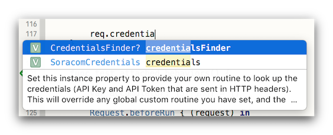
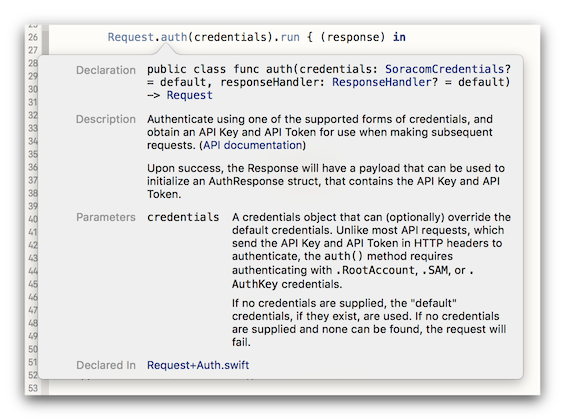

# soracom-sdk-swift

An SDK for the Soracom API in Swift.

Current status: This SDK is a work in progress, and is still in the beta testing stage. It now implements the complete SORACOM API, but bugs and omissions are expected at this stage. (Bug reports are welcome!)

## Target audience & requirements

This SDK is intended for programmers who want to interact with the [Soracom API](https://dev.soracom.io/jp/docs/api_guide/) from Swift code.

This SDK requires Swift 4.2.

It supports macOS 10.14 and higher, iOS 12 and higher, and Linux (reference platform is Ubuntu 18.04, and other Linux variants may be problematic at this stage).

## Release history

- **2018-11-10:** 1.0.0-beta.2 released.
- **2018-09-17:** 1.0.0-beta.1 released.

## Components

- The **SoracomAPI** swift package itself. This is the core of the SDK, and it should build with `swift build` on all supported platforms.

- **MacDemoAppForSoracomAPI** is a demo app for macOS 10.14 and later (10.13 probably OK, too). It requires Xcode 10 to build, and its project can be found inside the `Whatever` directory.

- **iOSDemoAppForSoracomAPI** is a demo app for iOS 12 and later. It requires Xcode 10 to build, and its project can be found inside the `Whatever` directory. Note that due to Xcode/Simulator/iOS bugs with buiding an iOS dependent on a Swift package that uses the Keychain, this project just references the SDK's source code files directly, rather than using the SDK as a subproject.

## For more information

The Swift SDK source code itself is extensively documented, which means the standard Xcode conveniences work, such as auto-complete with documentation hints:

...and ⌘-click to show documentation popup in the source code editor (linked to the Soracom API documentation, wherever appropriate):

The [Soracom API Guide](https://dev.soracom.io/en/docs/api/) is the canonical reference for the API itself.

## License

This project is licensed under the MIT license. See the file `Whatever/LICENSE` for details.

以上
